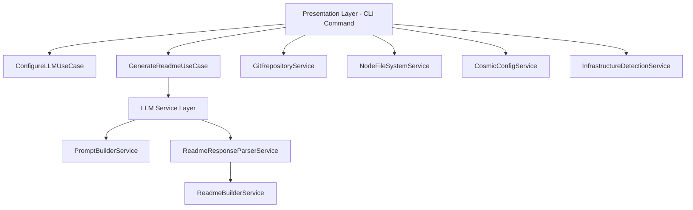
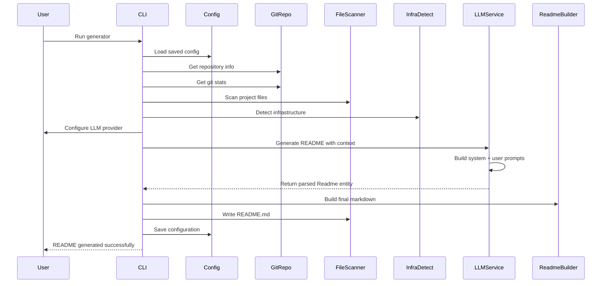

<a id="top"></a>

<p align="center">
  
</p>

<h1 align="center">🚀 ReadMe-Generator</h1>
<p align="center"><em>Transform your codebase into stunning documentation with AI-powered intelligence</em></p>

<p align="center">
    <a aria-label="ElsiKora logo" href="https://elsikora.com">
      
    </a>
             
</p>

> [!NOTE] **Why 🚀 ReadMe-Generator?**
>
> - 🤖 **6 AI Providers** — Choose from OpenAI, Anthropic, Google, Azure OpenAI, AWS Bedrock, or Ollama (local) for maximum flexibility
> - 🏗️ **Clean Architecture** — Built with DDD principles, dependency injection, and clear separation of concerns for easy extensibility
> - 📊 **Deep Code Intelligence** — Scans project files, detects infrastructure, computes language stats, and generates mermaid architecture diagrams
> - ⚡ **Zero Config to Full Control** — Works out of the box with interactive prompts, or use configuration files for fully automated CI/CD workflows

## 📚 Table of Contents

- [Description](#-description)
- [Tech Stack](#-tech-stack)
- [Features](#-features)
- [Architecture](#-architecture)
- [Project Structure](#-project-structure)
- [Prerequisites](#-prerequisites)
- [Installation](#-installation)
- [Usage](#-usage)
- [Contributing](#-contributing)
- [Roadmap](#-roadmap)
- [FAQ](#-faq)
- [License](#-license)
- [Acknowledgments](#-acknowledgments)

## 📖 Description

ReadMe-Generator is an advanced command-line utility that revolutionizes how developers create project documentation. By leveraging cutting-edge AI models from **OpenAI**, **Anthropic**, **Google**, **Azure OpenAI**, **AWS Bedrock**, and **Ollama**, this tool performs deep analysis of your entire codebase to generate comprehensive, context-aware README files that truly capture the essence of your project.

Built with **clean architecture principles** and **domain-driven design**, ReadMe-Generator goes far beyond simple template filling. It intelligently scans your project structure, understands your technology stack, detects infrastructure tooling, computes language statistics, and creates beautifully formatted documentation complete with badges, mermaid diagrams, feature lists, installation guides, and usage examples.

Whether you're maintaining an open-source library, documenting an internal tool, or preparing a project for public release, ReadMe-Generator ensures your documentation is professional, comprehensive, and engaging — all generated in seconds with a single command.

### Real-World Use Cases

- **Open Source Maintainers**: Instantly generate polished READMEs for new releases, ensuring consistent documentation quality across projects
- **Enterprise Teams**: Integrate into CI/CD pipelines to keep documentation automatically synchronized with code changes
- **Hackathon Participants**: Generate professional project documentation in seconds, letting you focus on building
- **DevRel Engineers**: Quickly produce documentation in multiple languages for global developer communities

## 🛠️ Tech Stack

| Category            | Technologies                                                        |
| ------------------- | ------------------------------------------------------------------- |
| **Language**        | TypeScript, JavaScript                                              |
| **Runtime**         | Node.js                                                             |
| **Build Tool**      | Rollup, TypeScript Compiler                                         |
| **Testing**         | Vitest                                                              |
| **Linting**         | ESLint, Prettier                                                    |
| **CI/CD**           | GitHub Actions, Semantic Release                                    |
| **Package Manager** | npm                                                                 |
| **AI Providers**    | OpenAI, Anthropic, Google Gemini, Azure OpenAI, AWS Bedrock, Ollama |
| **CLI Framework**   | Commander, Prompts, Chalk, Clack Prompts                            |
| **Configuration**   | Cosmiconfig, dotenv                                                 |

## 🚀 Features

- ✨ **🤖 **Multi-AI Provider Support** — Choose from OpenAI (GPT-5/4o), Anthropic (Claude 4.x/3.x), Google (Gemini 3/2.5), Azure OpenAI, AWS Bedrock, or local Ollama models**
- ✨ **📊 **Intelligent Code Analysis** — Deep recursive scanning with configurable depth (1-7 levels) to understand your project structure, dependencies, and architecture**
- ✨ **🎨 **Automatic Logo Generation** — Creates custom gradient-style project logos locally using Canvas, with automatic upload to Imgur or Socialify fallback**
- ✨ **🏗️ **Mermaid Architecture Diagrams** — AI-generated flowcharts and sequence diagrams that accurately represent your project's real architecture**
- ✨ **🌍 **Multi-Language Documentation** — Generate READMEs in English, Spanish, French, German, Russian, and more**
- ✨ **🏷️ **Smart Badge Detection** — Automatically identifies and adds relevant technology badges from 200+ predefined badges based on your actual stack**
- ✨ **📝 **Context-Aware Content** — Generates descriptions, features, usage examples, FAQs, and roadmaps tailored to your specific project's code**
- ✨ **🔧 **Persistent Configuration** — Saves preferences via Cosmiconfig for one-command regeneration in future runs**
- ✨ **🔄 **Remote Repository Support** — Clone and analyze any Git repository by URL without needing local checkout**
- ✨ **📦 **Infrastructure Detection** — Automatically detects CI/CD, containerization, linting, testing, bundlers, and package managers**
- ✨ **🔒 **Secure API Key Handling** — API keys are read from environment variables or masked password prompts, never stored in config files**
- ✨ **⚡ **CI/CD Ready** — Skip all confirmations with `--skip-confirmations` for fully automated documentation pipelines**

## 🏗 Architecture

### System Architecture



### Data Flow



## 📁 Project Structure

<details>
<summary>Click to expand</summary>

```
ReadMe-Generator/
├── .github/
│   ├── workflows/
│   │   ├── mirror-to-codecommit.yml
│   │   ├── qodana-quality-scan.yml
│   │   ├── release.yml
│   │   ├── snyk-security-scan.yml
│   │   └── test.yml
│   └── dependabot.yml
├── bin/
│   ├── index.js
│   └── index.js.map
├── src/
│   ├── application/
│   │   ├── constant/
│   │   ├── interface/
│   │   ├── use-case/
│   │   └── index.ts
│   ├── domain/
│   │   ├── constant/
│   │   ├── entity/
│   │   ├── enum/
│   │   ├── value-object/
│   │   └── index.ts
│   ├── infrastructure/
│   │   ├── constant/
│   │   ├── di/
│   │   ├── git/
│   │   ├── llm/
│   │   ├── service/
│   │   └── index.ts
│   ├── presentation/
│   │   ├── cli/
│   │   └── index.ts
│   └── index.ts
├── test/
│   ├── e2e/
│   │   └── integration/
│   ├── helpers/
│   │   ├── e2e-utils.ts
│   │   ├── test-cli-wrapper.js
│   │   └── test-utils.ts
│   ├── mocks/
│   │   └── llm-service.mock.ts
│   ├── unit/
│   │   ├── application/
│   │   ├── domain/
│   │   └── infrastructure/
│   └── README.md
├── CHANGELOG.md
├── commitlint.config.js
├── eslint.config.js
├── generated-logo.png
├── LICENSE
├── lint-staged.config.js
├── package-lock.json
├── package.json
├── prettier.config.js
├── README.md
├── release.config.js
├── rollup.config.js
├── tsconfig.json
├── vitest.e2e.config.js
└── vitest.unit.config.js
```

</details>

## 📋 Prerequisites

- Node.js >= 16.0.0
- npm >= 7.0.0
- Git (for repository analysis)
- An API key from at least one supported AI provider (OpenAI, Anthropic, Google, Azure, AWS, or a local Ollama instance)

## 🛠 Installation

```bash
# Install globally for system-wide usage
npm install -g @elsikora/readme-generator

# Or install as a dev dependency in your project
npm install --save-dev @elsikora/readme-generator

# Using yarn
yarn add -D @elsikora/readme-generator

# Using pnpm
pnpm add -D @elsikora/readme-generator
```

## 💡 Usage

## Basic Usage

Navigate to your project directory and run the generator:

```bash
cd your-awesome-project
@elsikora/readme-generator
```

The interactive CLI will guide you through:

1. **Repository source** — Use current directory or provide a Git URL
2. **Logo generation** — Socialify card, local gradient, or custom URL
3. **Project context** — Optional additional context for the AI
4. **Scan depth** — How deeply to analyze your project files
5. **Language** — Output language for the README
6. **AI provider** — Select and configure your preferred LLM

## Configuration File

Create `.elsikora/readme-generator.config.js` for persistent settings:

```javascript
export default {
	language: "en",
	llm: {
		provider: "anthropic",
		model: "claude-sonnet-4-5",
	},
	logoType: "local",
	scanDepth: 5,
	repositoryOwner: "your-username",
	repositorySource: "local",
	shouldIncludeContributors: true,
	shouldIncludeGithubBadges: true,
	shouldSkipConfirmations: false,
	contextTemplate: "This project is a CLI tool for...",
};
```

## Environment Variables

Set your AI provider API key as an environment variable:

```bash
# OpenAI
export OPENAI_API_KEY=sk-...

# Anthropic
export ANTHROPIC_API_KEY=sk-ant-...

# Google
export GOOGLE_API_KEY=AI...

# Azure OpenAI (format: endpoint|api-key)
export AZURE_OPENAI_API_KEY=https://myazure.openai.azure.com|your-key

# AWS Bedrock (format: region|access-key-id|secret-access-key)
export AWS_BEDROCK_API_KEY=us-east-1|AKIA...|secret...

# Ollama (optional, defaults to http://localhost:11434)
export OLLAMA_API_KEY=http://localhost:11434
```

## CI/CD Integration

```yaml
# .github/workflows/update-readme.yml
name: Update README
on:
  push:
    branches: [main]
    paths: ['src/**', 'package.json']

jobs:
  update-readme:
    runs-on: ubuntu-latest
    steps:
      - uses: actions/checkout@v4
      - uses: actions/setup-node@v4
        with:
          node-version: '20'
      - run: npm install -g @elsikora/readme-generator
      - run: @elsikora/readme-generator
        env:
          ANTHROPIC_API_KEY: ${{ secrets.ANTHROPIC_API_KEY }}
      - uses: stefanzweifel/git-auto-commit-action@v4
        with:
          commit_message: 'docs: update README.md'
```

## Remote Repository Analysis

Analyze any public Git repository without cloning it locally:

```bash
@elsikora/readme-generator
# Select "Provide Git repository URL"
# Enter: https://github.com/username/repo.git
```

## Supported AI Models

| Provider         | Popular Models                                       | Best For                                             |
| ---------------- | ---------------------------------------------------- | ---------------------------------------------------- |
| **OpenAI**       | GPT-5.2, GPT-5, GPT-4o, O3                           | Creative descriptions, comprehensive docs            |
| **Anthropic**    | Claude Opus 4.6, Claude Sonnet 4.5, Claude Haiku 4.5 | Technical accuracy, structured content               |
| **Google**       | Gemini 3 Pro, Gemini 2.5 Pro/Flash                   | Multilingual documentation, fast generation          |
| **Azure OpenAI** | GPT-5.2, GPT-4o, O3                                  | Enterprise environments with Azure                   |
| **AWS Bedrock**  | Claude Sonnet 4.5, Nova Pro, DeepSeek R1             | Enterprise AWS integration                           |
| **Ollama**       | Llama 4, Qwen 3, Phi 4, Gemma 3                      | Local/offline generation, privacy-sensitive projects |

## 🤝 Contributing

We welcome contributions from the community! Here's how you can help:

### 🐛 Reporting Bugs

1. Check the [existing issues](https://github.com/ElsiKora/ReadMe-Generator/issues) to avoid duplicates
2. Use the bug report template when creating a new issue
3. Include steps to reproduce, expected behavior, and actual behavior
4. Include your Node.js version, OS, and AI provider used

### 💡 Suggesting Features

1. Open a [feature request issue](https://github.com/ElsiKora/ReadMe-Generator/issues/new)
2. Describe the use case and expected behavior
3. Explain why this feature would benefit other users

### 🔧 Submitting Pull Requests

1. Fork the repository and create a branch from `dev`
2. Install dependencies: `npm install`
3. Make your changes following the existing code architecture (DDD layers)
4. Write or update tests: `npm run test:unit`
5. Ensure linting passes: `npm run lint:all`
6. Format code: `npm run format:fix`
7. Commit using conventional commits (enforced by commitlint):
   ```bash
   npm run commit
   ```
8. Submit a PR against the `dev` branch

### 📋 Code Style Requirements

- **TypeScript strict mode** with all strict checks enabled
- **ESLint** with comprehensive ruleset (Sonar, Unicorn, Perfectionist, JSDoc, etc.)
- **Prettier** for consistent formatting (tabs, 480 print width)
- **Conventional Commits** enforced via commitlint
- Follow the existing **Clean Architecture** pattern:
  - `domain/` — Entities, value objects, enums (no dependencies)
  - `application/` — Use cases and interfaces
  - `infrastructure/` — Concrete implementations
  - `presentation/` — CLI commands

## 🛣 Roadmap

<details>
<summary>Click to expand</summary>

| Task / Feature                                                            | Status         |
| ------------------------------------------------------------------------- | -------------- |
| Multi-AI Provider Support (OpenAI, Anthropic, Google, Azure, AWS, Ollama) | ✅ Done        |
| Clean Architecture with DDD Implementation                                | ✅ Done        |
| Interactive CLI with Prompts                                              | ✅ Done        |
| Automatic Local Logo Generation (Canvas)                                  | ✅ Done        |
| Persistent Configuration via Cosmiconfig                                  | ✅ Done        |
| Remote Repository Cloning & Analysis                                      | ✅ Done        |
| Infrastructure & Tooling Auto-Detection                                   | ✅ Done        |
| Mermaid Architecture Diagram Generation                                   | ✅ Done        |
| Multi-Language README Generation                                          | ✅ Done        |
| Unit & E2E Testing Suite with Vitest                                      | ✅ Done        |
| Semantic Release with Beta Channel                                        | ✅ Done        |
| Google Gemini 3 Model Support                                             | ✅ Done        |
| Custom Template System                                                    | 🚧 In Progress |
| VS Code Extension                                                         | 🚧 In Progress |
| GitHub App Integration                                                    | 🚧 In Progress |
| README Preview in Terminal                                                | 🚧 In Progress |
| Badge Customization UI                                                    | 🚧 In Progress |

</details>

## ❓ FAQ

<details>
<summary>Click to expand</summary>

**Q: Which AI provider should I choose?** A: Each provider has its strengths:

- **OpenAI (GPT-5/4o)**: Best for creative, engaging descriptions and comprehensive documentation
- **Anthropic (Claude)**: Excellent for technical accuracy and well-structured content
- **Google (Gemini)**: Great for multilingual support and fast generation
- **AWS Bedrock / Azure OpenAI**: Ideal for enterprise environments already using these cloud platforms
- **Ollama**: Perfect for offline usage, privacy-sensitive projects, or when you want free local generation

**Q: How much does it cost to use?** A: The tool itself is free and open-source (MIT). You only pay for AI API usage based on your chosen provider's pricing. Using Ollama is completely free as it runs locally.

**Q: Can I use this in my CI/CD pipeline?** A: Absolutely! Set `shouldSkipConfirmations: true` in your config file and provide your API key via environment variables for fully automated workflows.

**Q: How deep should I set the scan depth?** A: For most projects, depth 3 (Deep) is sufficient. Use depth 5-7 for monorepos or deeply nested projects. Higher depths provide more context to the AI but increase token usage.

**Q: Is my code sent to AI providers?** A: Yes, scanned file contents are sent to generate context-aware documentation. If this is a concern, use **Ollama** for fully local generation where no data leaves your machine.

**Q: What file types are scanned?** A: The tool scans common code files (.ts, .js, .py, .go, .rs, .java, .json, .yaml, .md, etc.) while intelligently ignoring build artifacts, node_modules, lock files, and binary files.

**Q: Can I generate READMEs in multiple languages?** A: Yes! Select from English, Spanish, French, German, or Russian during the interactive flow, or set the `language` field in your config file.

**Q: Can I analyze a remote repository without cloning it locally?** A: Yes! Select "Provide Git repository URL" when prompted, and the tool will clone it to a temporary directory, analyze it, and clean up automatically.

**Q: How do I update the generated README later?** A: Simply run the tool again. Your configuration is saved, so with `shouldSkipConfirmations: true`, it regenerates with a single command.

</details>

## 🔒 License

This project is licensed under **MIT**.

## 🙏 Acknowledgments

- Built with [Commander](https://github.com/tj/commander.js) and [Prompts](https://github.com/terkelg/prompts) for the interactive CLI experience
- Configuration management powered by [Cosmiconfig](https://github.com/cosmiconfig/cosmiconfig)
- Logo generation using the [Canvas](https://github.com/Automattic/node-canvas) library
- Badge designs courtesy of [Shields.io](https://shields.io/)
- Social preview images via [Socialify](https://socialify.git.ci/)
- DI container provided by [@elsikora/cladi](https://github.com/ElsiKora/cladi)
- Semantic versioning automated with [semantic-release](https://github.com/semantic-release/semantic-release)
- Special thanks to all [contributors](https://github.com/ElsiKora/ReadMe-Generator/graphs/contributors) who help improve this project

---

<p align="center">
  <a href="#top">Back to Top</a>
</p>
